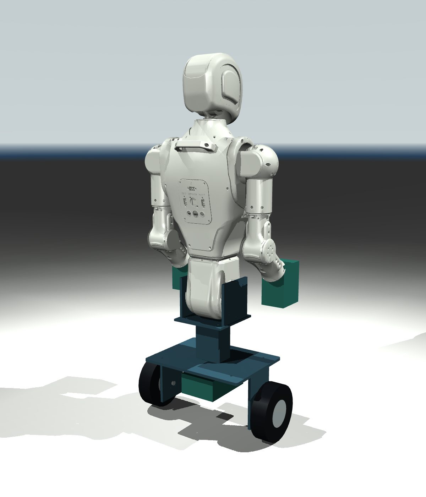
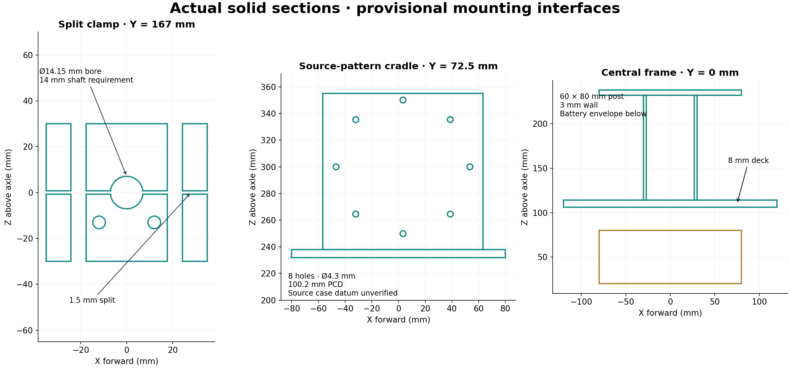

# Asimov upper body on a smaller custom balancing base

## 1. Delivered scope and release stage

**Release: CAD prototype with simulated control evidence.** This is a fresh design. Neither rejected body design is used. It combines the pinned Asimov pelvis, torso, head and arm meshes/inertials with a new 160 mm wheel base. It does not reuse a complete commercial hoverboard chassis. The hoverboard repository supplies a motor-firmware reference, not a proven self-balancing platform.

Open [the illustrated review](review.html), [editable parameters](parameters.json), [editable CadQuery model](cad/build.py), [neutral base assembly](cad/concept/new_base.step), [mass BOM](parts_list.csv), and [hardware procurement register](hardware_procurement.csv). All 18 individual STEP solids are in `cad/concept/`. The combined source-linked robot is represented by `simulation/articulated.xml`; the upper body remains original source meshes, not newly reconstructed watertight CAD. [Sections](visuals/interface_sections.png) and 11 other engineering images accompany the model.

No new part is released for fabrication. Native CAD validity is not manufacturing validation. Wheels, battery and hands are explicitly envelopes/allowances; their purchase interfaces remain unresolved. This delivers an integrated modeled idea and inspectable evidence. A complete purchasable parts list, measured motor/thermal ratings, assembled specimen and hardware firmware port are incomplete.

From this directory, with Python 3.12 and GCC available:

```sh
python -m pip install -r requirements.txt
python rebuild.py
```

Rendering requires an EGL-capable graphics environment; `--skip-render` retains the delivered renders. The ZIP preserves the repository paths needed by the models and includes the 14 retained source meshes. In a normal checkout those assets already reside in `sim-model/assets/meshes/`.

## 2. Operating envelope and acceptance criteria

These are proposed review requirements, not certified operating limits. Coordinates: +X forward, +Y left, +Z up; axle is the new model origin. CAD is in mm; physics is SI. The neutral model starts 1 mm above the floor and settles on contact.

| Item | Review assumption or criterion | Evidence / status |
| --- | --- | --- |
| Geometry | Ø160 × 45 mm wheels, 400 mm track, 445 mm overall wheel width | CAD; upper top approximately 1.047 m above floor |
| Normal motion | Flat dry indoor floor; commanded speed ≤0.4 m/s; gentle symmetric arm reach | Proposal, not a tested complete envelope |
| Motor output | 6 Nm maximum per wheel; actual torque calibration required | Simulation assumption, no selected motor |
| Balance loop | 5 ms control period and 5 ms torque delay | Simulated; hardware timing unmeasured |
| Recovery criterion | At 8 s: pitch/COM pitch <1°, pitch rate <0.02 rad/s; no fall | Used in simulations; source of criterion is this prototype |
| Driving criterion | Same balance criterion, path error <30 mm and heading error <1° at 8 s | **Fails path accuracy:** 34.37 mm; heading error 0.118° |
| Structural screen | 2g vertical / 0.5g horizontal; factor 2 against assumed yield; simplified load paths | Calculations only; fatigue, weld and case proof incomplete |
| CAD round trip | Valid single solids; relative volume error <1e-7; dimension error <0.001 mm | Passed for all 18 new solids |
| Parking | Supports manually fitted before power-off | Static contact model holds; automatic catch/stow mechanism absent |

Recovery experiments reach speeds above the proposed 0.4 m/s normal motion limit. They are research perturbations, not evidence of protected recovery within that speed limit. A candidate C fault guard uses COM pitch >10°, roll >5° or stale samples >20 ms; it returns zero torque. **Zero torque does not keep this two-wheel body standing.** Independent mechanical support remains required.

Exclude stairs, curbs, impacts, outdoor/wet use, carrying people, contact with people, arbitrary arm poses/payloads, and unprotected power-loss operation. No thermal duty or runtime is established. The 15° simulation recovery does not override the narrower candidate fault guard.

## 3. Sources and original parts

| Source | Pinned revision | Used scope |
| --- | --- | --- |
| [egc365/asimov-1](https://github.com/egc365/asimov-1) | `35ae7b3581ce36762bfddb00b8fc5e7c957ee7fa` | Original MJCF/URDF, 14 upper link meshes/inertials, pelvis STEP datums, manufacturing inventory |
| [egc365/hoverboard-firmware-hack-FOC](https://github.com/egc365/hoverboard-firmware-hack-FOC) | `4f141cbc97b297e194fd58e56444bd0322f902ac` | Config, serial interface, main loop and FOC control reference |
| Menlo official Asimov 1 documentation | Accessed 2026-10-07; live documentation, not the pinned model | Actuator identification, module checklists, voltage and software architecture |

Retained: pelvis, waist, both complete five-joint arms, two fixed neck links and head. Original mass, COM tensors and body transforms are preserved for all 14 link bodies. Source upper mass is **19.3323 kg**. Both leg subtrees are removed. The original pelvis representation and its two hip-pitch motor contents are retained conservatively; their cost and mass are not claimed as savings.

Added: aluminum frame, source-pattern pelvis cradles, split axle torque clamps, wheel/battery envelopes and four removable parking struts. Hands add a combined 1 kg allowance, not a sourced hand design. CAD solids drive the new metal mass; purchased assemblies use declared allowances.

`source/mechanical_inventory.json` records all 165 source fabrication STEP paths. The upper module groups 100/200/300/400/700 contain 91 paths; inventory counts do not equal assembled quantities. Actual upper hardware identification is in `hardware_procurement.csv` and official checklists. No shipping kit or complete source BOM was obtained.

`ASV1_200_03A.STEP` imports as valid. `ASV1_200_16A.STEP` remains invalid in the native importer and after a generic healing attempt. Both are preserved unchanged; the invalid file is not substituted into the new solid export. The complete 386 MB source robot STEP was not retrieved or rebuilt. Full upper fit checks therefore use source meshes plus the selected original interface solid.

## 4. Selected design and alternatives



An 8 mm deck bridges the two axle seats. A short 60 × 80 × 118 mm hollow post, with 3 mm walls, raises two metal cradles to the original pelvis mounting frames. This keeps the upper body recognizable while reducing base wheel diameter. The new pelvis X placement is solved from the combined neutral mass, then shared by CAD and simulation in `cad/concept/placement.json`; there is no independent hidden COM shift in the simulator.



The cradles project the original left hip plate's eight Ø4.3 mm holes on a 100.2 mm PCD to the two source hip frames. The right counterpart is treated as mirrored and needs physical confirmation. A proposed 1 mm case-face spacer and 2 mm under-housing gap prevent an assumed load path through the plastic shell. Source case-face datum, screw stack and metal case capacity still need verification. Bolting onto an original housing is not accepted merely because holes align.

Each wheel axle is retained by a two-piece split clamp: two M6 preload screws and two M5 attachments to the axle seat. A 14 mm shaft and 14.15 mm bore are requirements, not claims about an off-the-shelf motor. Real axle flats would require a matching insert or keyed torque arm. Parking struts are removable supports, not automatic landing gear; their stowed layout is not modeled.

Rejected alternatives: 6 mm deck and 12 mm assumed steel axle fail the selected screens; proportional shrink of the full robot would invalidate actuator/mount interfaces and is not used. A commercial hoverboard shell was not selected because no source mechanical interface was established. A cheap custom upper body may eventually reduce cost, but replacing Asimov actuators and structure is a separate design requiring new interfaces and controls.

## 5. Failure mechanisms and responses

| ID | Mechanism and evidence | Response / residual issue | Test |
| --- | --- | --- | --- |
| FAIL-001 | Power cut at t=1 s reaches 45° pitch at t≈1.852 s | Manually park before power-off; automatic catch absent | TEST-DYN-02 |
| FAIL-002 | 10° initial lean, μ=0.1 falls at ≈1.084 s | Nominal μ=0.6; measure tyre/floor friction; restrict floor | TEST-DYN-03 |
| FAIL-003 | Added 40–80 ms planar delay misses recovery; 100 ms falls | Local balance layer; review filter/serial scheduling changes | TEST-DYN-04 |
| FAIL-004 | Slow arm reach with fixed-body balance drifts −420.76 mm | Joint-dependent COM feedback gives −0.159 mm final drift in model; hardware estimator missing | TEST-DYN-05 |
| FAIL-005 | Combined reach, drive and yaw tracks heading but ends 34.37 mm long | Keep 30 mm criterion failed; refine tracking before release | TEST-DYN-06 |
| FAIL-006 | 6 mm welded-zone deck margin 0.809; 12 mm shaft margin 0.861 | 8 mm / 14 mm selected; assumptions need coupon/load proof | TEST-CALC-01 |
| FAIL-007 | Split clamp friction/preload governs torque retention | Model explicit clamp; verify slip torque and actual shaft form | TEST-CALC-02 / TEST-PHY-MOUNT |
| FAIL-008 | Two shoulder-yaw extreme poses intersect pelvis/arm meshes | Restrict to sampled slow-reach trajectory; collision guard not yet implemented | TEST-MESH-01 |
| FAIL-009 | Asimov 13S pack and stock 10S drive domain differ | Separate proposed drive pack; verify board voltage, grounding and regeneration | TEST-PHY-ELECTRICAL |
| FAIL-010 | Native waist mounting STEP invalid; source case load capacity unknown | Preserve failure; inspect actual mounting metal and source CAD | TEST-CAD-02 / TEST-PHY-MOUNT |
| FAIL-011 | Unselected motors have no verified continuous torque/thermal data | No continuous rating, runtime or price claimed | TEST-PHY-THERMAL |

The lateral static tip calculation is about 23.2° at neutral posture. It assumes no slip and fixed COM; rolling control cannot correct lateral roll. It is not a permission to operate at that angle.

## 6. Loads, mass, COM, thermal and tolerances

[Complete calculation results](checks/engineering_results.json) preserve units and assumptions. [Mass chart](visuals/mass_budget.png) and the mass BOM reconcile exactly with the physics model.

| Quantity | Value | Evidence |
| --- | --- | --- |
| Original upper links | 19.3323 kg | Pinned MJCF; not hardware weighing |
| New aluminum, including parking struts | 4.42194 kg | Actual CAD volume × assumed 2700 kg/m³ |
| Two wheel/motor assemblies | 3.000 kg | Allowance |
| Drive battery | 2.300 kg | Allowance |
| Hands | 1.000 kg | Allowance |
| Extra electronics / harness | 0.600 / 0.350 kg | Allowances |
| Total | **31.0042 kg** | Integrated modeled budget |
| Non-wheel COM height above axle | 0.428129 m | Source tensors + new placements |
| Whole-body COM height above ground | 0.466703 m | Nominal fixed posture; parking mass at assumed stow height |
| Body pitch inertia about COM | 1.64814 kg·m² | Original tensors; new part bounding-box inertia approximation |

The parked model retains the balancing model's equivalent parking-support mass location, not exact deployed inertias. Weigh the actual upper assembly and determine whether battery/electronics already lie inside its source inertials; otherwise mass may be omitted or duplicated. Planar screening varies non-wheel mass by 0.8–1.4×, but does not replace that audit.

Mass integration: `r_COM = Σ(m_i r_i)/Σm_i`; inertia uses each original tensor transformed into the axle frame plus the parallel-axis term. New solid-box inertia is an approximation, although new material mass comes from actual solid volume.

Deck screen: span L=0.312 m, width b=0.240 m, t=0.008 m, E=69 GPa. At F=2mg=608.30 N, `M=FL/4`, `I=bt³/12`, `σ=Mt/(2I)`, `δ=FL³/(48EI)`. Results: 18.53 MPa and 0.545 mm. Assumed weld-zone yield 80 MPa, concentration factor 1.5 and factor 2 give margin **1.439**. This is a one-dimensional screen, not FEA, fatigue proof or weld qualification. Suggested 6061-T6 parent stock must not be treated as retaining T6 strength at welds.

Axle screen: 304.15 N per wheel at 2g, 44 mm cantilever, 6 Nm torsion, assumed steel yield 250 MPa and bending concentration 1.8. At 14 mm, von Mises stress is 91.48 MPa and factor-to-yield 2.733 (margin against factor 2: **1.366**). Source shaft material, flats and root radius are unknown. The tube-only horizontal screen gives 2.80 MPa at 0.5g; it does not validate the weld or pelvis connection.

Clamp screen: two assumed 7 kN M6 preloads, μ=0.15 and shaft radius 7 mm yield `T=2μNr=14.7 Nm`. To retain factor 2 against 6 Nm requires μ≥0.12245. Estimated cap bending stress is 79.49 MPa. This is not verified retention and **does not specify a wrench torque**. Lubrication, shaft flats, relaxation and bolt engagement change it.

| Critical fit | Nominal / proposed tolerance | Worst-case result or blocker |
| --- | --- | --- |
| Shaft / clamp bore | Ø14±0.02 / Ø14.15±0.05 mm | Diametral clearance 0.08–0.22 mm; no coating included |
| Clamp split | 1.5 mm | Preload/compliance not measured |
| Cradle holes | 8×Ø4.3 mm, PCD100.2 mm | Nominal from source circles; positional tolerances unavailable |
| Case spacer / under-housing gap | 1 mm / 2 mm | Proposed; actual datum stack unresolved |
| Wheel-to-seat clearance | 17.5 mm | CAD nominal; clamp reduces nearest wheel gap to 3.5 mm |
| Frame-to-floor clearance | 34 mm | CAD nominal; tyre compression and floor obstacles excluded |

At 0.4 m/s, wheel speed is 47.75 rpm; 6 Nm gives 30 W mechanical output per wheel. This is not electrical consumption or a continuous power rating. `P_copper=I_rms²R`; winding resistance, torque constant, thermal resistances and duty cycle are unavailable. A 15 A firmware current limit would require effective Kt≥0.4 Nm/A to reach 6 Nm; current-limit configuration alone establishes no such torque.

## 7. Actuators and software adaptation

The source hardware register retains 15 identified original actuator assemblies: 13 upper powered joints plus the two inactive hip-pitch motors retained in the pelvis representation. The simulation articulates 11 upper hinges, locks the neck as in the pinned source, and adds two wheel hinges: 13 simulated actuators total. Shoulder/elbow/waist limits use published 30/25/20/12/40 Nm continuous values as caps. Published joint friction is not implemented; pinned source friction is zero. Neck motors are not removed from the cost register.

Replacing these actuators requires verified mounting datums, bearing load capacity, gearbox backlash, encoder, CAN protocol, supply/regen ratings, torque-speed curve and thermal data. The two proposed wheel motors are not selected products. Do not order based solely on 160 mm diameter or a 6 Nm advertisement.

Asimov's supplied CM5 image includes a **biped locomotion policy**. Its model and 25-joint trajectory schema cannot simply operate this wheeled body. The public SDK has examples, but the user's pinned repository contains no buildable low-level motion firmware or policy weights to patch. This package adds a compiled independent prototype layer; it does not claim that the shipped image was modified.

| Required change | Delivered piece | Still required for hardware |
| --- | --- | --- |
| Replace biped locomotion for this topology | Two-wheel LQR, articulated COM-feedback experiment, drive/yaw reference experiment | Integrate a separate wheeled mode into available low-level firmware; do not invoke biped MOVE |
| Preserve upper motion | Original joint signs/ranges and 11-joint PD experiment | Release-specific actuator/bus map; upper command adapter, rate and collision limits |
| Use fresh body and wheel state | COM from source inertials and joint state in simulation | IMU calibration, joint/encoder timestamps, sensor fusion, ground-contact and slip estimation |
| Local deterministic control | `balance_core.c`, generated gain header; 1000 C/Python comparisons | Real-time 200 Hz task, jitter/latency logging, measured torque calibration |
| Independent wheel torque commands | Exact source UART codec; tank steering mapping; 18/22-byte feedback modes | Correct wheel polarity after source direction macros, physical port voltage and board selection |
| Remove source command lag | `hoverboard_review.patch`: TRQ_MODE, tank mapping, filter/rate changes, odometry and feedback cadence | Build exact board variant, bench-check current/torque response and noise; no flash performed |
| Safe startup/shutdown/faults | Candidate input freshness/pitch/roll guards | Parking interlock/catch, arming, power supervision and safe load transfer; zero torque alone falls |

The hoverboard README says balancing is not implemented for `VARIANT_HOVERBOARD`; FOC is a motor control loop. A separate whole-body balance loop is necessary. Default main loop is nominally 5 ms plus work; its 0.1 filter has approximately 47.46 ms response time. The source serial example's 100 ms interval is unsuitable for balance. Default feedback every second main iteration is not a verified 200 Hz state loop. UART byte timing alone excludes scheduling jitter.

The C core's `yaw_torque_Nm` input means **per-wheel differential**, added to left and subtracted from right, not world-axis yaw torque. The driving experiment converts desired positive +Z yaw to left-minus/right-plus differential using radius/track, with a PI yaw controller. Port this sign convention deliberately. The simulation controller uses ground-truth COM; the physical estimator is not delivered.

Official Asimov external telemetry is 10 Hz and trajectory streaming about 50 Hz; use local sensors for the balance loop. Asimov DAMP is compliant mode, not emergency stop, and is not a suitable unsupported two-wheel shutdown procedure.

## 8. Parts, suppliers and cost

`parts_list.csv` has 35 mass/assembly rows. `hardware_procurement.csv` has 81 source hardware and new requirement rows, including actual actuator types/IDs and original manufactured part numbers. Its rows refine source subassemblies; **do not add their mass again**. Original assembly inventory is not a vendor quotation or complete fabrication kit.

Proposed new frame material: 6061-T6 aluminum parent stock, CNC/drilled plate and commercial rectangular tube, with qualified weld process and assumed lower weld-zone strength. Source hardware process/material tags remain those in its pinned paths (including PA12 and metal parts). Wheel shaft grade is unselected; 250 MPa yield is an assumption. Clamp M6 8.8 grade is proposed, with manufacturer proof/installation data still required. New screw lengths, source fastener substitutions, fuses, battery retention and wiring remain unresolved.

**Verified priced SKUs: zero, as of 2026-10-07. No complete $100, $200 or $500 build claim is supported.** No $500 camera is budgeted. Camera cost is not what determines the 15-actuator source architecture. Retaining an existing Asimov upper body changes the question to incremental base cost; building everything from scratch includes those upper actuators, boards and manufactured modules.

| Whole-build cap | Cap divided by the 15 retained actuator assemblies, before any other parts | Meaning |
| --- | --- | --- |
| $100 | $6.67 each | Arithmetic budget allocation, not an available actuator price |
| $200 | $13.33 each | Same; frame, drive, battery, compute and camera still unbudgeted |
| $500 | $33.33 each | No verified supply chain meets this here |

A legitimate estimate requires quotes for the exact upper parts, two wheel motors, drive board, packs/BMS, metalwork and protection hardware. Total cost is `Σ(quantity × quoted unit price) + fabrication + shipping + tax`; every quotation remains blank rather than fabricated. Source README's full-robot kit figure is not a quote for this upper-body/base combination. Cheaper camera options can be evaluated after the actual camera interface and firmware compatibility are known.

## 9. Manufacturing and assembly review sequence

This is a proposed sequence to review once blockers are resolved, not authorization or a fabrication release.

1. Audit and weigh the retained upper assembly. Confirm the original actuator IDs, neck lock, pelvis metal interfaces and source case-face datums. Obtain valid waist mount CAD and physical screw stack.
2. Select the two motors and drive electronics. Measure shaft diameter/flats, axle shoulder, cable exit, bearing rating and motor COM. Replace the envelope and regenerate the frame before cutting metal.
3. Resolve alloy certificates, weld procedure, finish, all hole tolerances and fastener engagement. Cut/machine the deck, tube, cradles and axle seats; retain datums in a jig. Inspect weld distortion and cracks before assembly. Re-machine clamp bores after the chosen process as needed.
4. Attach the original metal pelvis interfaces through verified spacers and M4 hardware to the cradles. Keep load off the plastic shell. Verify case clearance and full fastener tool access on the actual assembly.
5. Assemble the split torque clamps and selected axles. Use documented supplier bolt settings; the 7 kN preload assumption is not an installation torque. Verify wheel clearance, axle retention and guarded slip/load proof.
6. Specify positive battery restraints, protected cable exits, strain relief, fuse, disconnect and power domains. The current envelope has no validated battery strap/latch or detailed harness. Source Asimov 13S charged voltage is 54.6 V; the pinned drive configuration assumes 10S. Do not connect them directly without the selected board's verified rating.
7. Fit the manual parking supports and verify the support polygon/load path. Design and validate stow/parking sensing before relying on them in operation. No deployed/stowed transition mechanism exists in this CAD.
8. On a catch rig, characterize controller timing and both wheel signs/torque constants, then IMU/joint state and the selected test plan. No hardware is automatically connected, flashed, energized or actuated by the scripts.

## 10. Interaction matrices and validation plan

`checks/base_pair_matrix.json` records every pair of the 18 new parts. Parking pairs are explicitly not run in the balancing configuration. `checks/interaction_results.json` records source/new mesh pairs across 102 poses: rest, five points per source joint, 25 deterministic combinations and 21 slow-reach samples. Intended mates are separately identified. Source meshes can be open; triangle nonintersection does not prove volume clearance. Hands and wiring are not covered.

`checks/physical_pairwise_plan.json` defines five factors: torque {3,6} Nm, local delay {5,20,40} ms, measured friction {0.2,0.6}, upper pose {rest,slow reach}, power {on,cut on catch rig}. A deterministic greedy plan covers every declared level pair; an independent set audit lists zero missing pairs. All generated physical rows are **not run**. This is neither full-factorial physical coverage nor proof of every vulnerability.

| Test ID | Completed evidence / result | Physical next step |
| --- | --- | --- |
| TEST-CAD-01 | 18 solids valid on fresh import; dimensions/volume passed; no new balancing-base volume overlaps | Measure manufactured parts and assembly stack |
| TEST-CAD-02 | Original 03A valid; original 16A invalid, repair attempt unsuccessful | Obtain valid source file / inspect specimen |
| TEST-CALC-01/02 | Beam, shaft, clamp and tolerance screens | Coupon, weld, axle, clamp and pelvis attachment proof; fatigue/duty definition |
| TEST-MESH-01 | 102 poses; rest and slow-reach samples clear; two source shoulder-yaw extreme poses intersect | Restrict commands; check actual swept clearance, hands and cables |
| TEST-DYN-01 | 63 planar cases: 41 recover; 14 contact cases: 10 meet their criteria | Guarded balance identification and perturbation tests |
| TEST-DYN-02/03/04 | Power loss, low friction and delay failures recorded | Catch rig and logged fault response |
| TEST-DYN-05 | Arm-dependent COM feedback eliminates modeled fixed-controller drift | Verify physical estimator and source mass properties |
| TEST-DYN-06 | Driving + yaw + arm reach remains upright but path criterion fails | Improve trajectory controller without changing the acceptance limit |
| TEST-SW-01 | GCC strict compile, 1000 torque comparisons, 4 fault cases, codec and six invalid CAD inputs pass | Board-target compile, calibrated Nm response, measured loop latency |
| TEST-PHY-MOUNT/ELECTRICAL/THERMAL | **Not run** | Resolve load path, voltage/regen, winding/controller heating and duty |

Research recovery cases bypass the narrower C fault envelope intentionally; they test controllability, not the complete production state machine. Planar traction clipping is a quasi-static bound; MuJoCo models contact and tyre slip with ideal cylindrical wheels. Neither includes motor electrical dynamics, tyre compliance, real sensor noise or published joint friction. These differences limit the precision of failure boundaries.

## 11. Observed CAD and numerical checks

Executed with CadQuery 2.7.0 / OpenCascade 7.8.1.1 and MuJoCo 3.15.0. Exact command sequence is in `rebuild.py`. Key reproducible operations:

```sh
python cad/build.py
python simulation/build_model.py
python simulation/balance.py
python checks/engineering.py
python checks/software.py
python checks/interactions.py
python simulation/contact_check.py
```

`cad_roundtrip.json` records fresh STEP reimports for all 18 names and the 18-solid assembly, nonzero volumes, validity and dimensional agreement. Bounding boxes use exact BRep bounds rather than cached triangulation bounds. Independent checks extract circle radii and source circle centers, confirm the deck/tube/wheel track, and validate the 2 mm under-housing gap. `source_interfaces.json` records measured source circles and frames; `source_heal.json` records the unsuccessful 16A repair attempt.

The intentional invalid inputs reject undersized deck, impossible wall, invalid wheel dimensions and other parameter errors. They do not prove all future edits valid. Rebuild and reread the failure tables after changing parameters; research sweep levels and proposed operating criteria also require conscious review.

The combined drive trace reaches 0.3784 m/s, final heading 34.496° against 34.377°, and final traveled path 0.93437 m against 0.90000 m at 8 s. It stays upright, but **fails** the 30 mm path criterion. The earlier yaw-controller failure is preserved separately in `driving_initial_failure.json`; it is not represented as the final controller result.

## 12. Service access and inspection triggers

The frame is open for axle clamp and electronics access. Actual battery removal, source screw tool access and cable clearance are not validated. Park and independently support the upper body before any mechanical service; disconnect both proposed power domains. Inspect clamp witness marks, axle movement, bolt loosening, cracks, weld distortion, chafing and tyre damage after assembly, a tip/catch event, collision, overload or abnormal temperature. No unsupported maintenance interval is assigned. Replacing a motor, tyre, hand or pack changes mass, torque calibration and potentially COM; rebuild and re-identify them.

## 13. Blockers and requirements trace

| Blocker | Next measurement / evidence | Consequence if unresolved |
| --- | --- | --- |
| Actual wheel motor/shaft/controller | Drawings, torque-speed and thermal data; bench calibration and quotation | No functional purchasable base BOM or validated torque |
| Source pelvis/case attachment | Face datums, valid 16A file, screw stack and connection load proof | Upper body can detach despite nominal CAD fit |
| Weld/axle/clamp construction | Material certificates, connection and slip tests | Yield or axle rotation before predicted margins |
| Power and harness | Actual board voltage/current/regen ratings, protection and retention design | Electrical damage; drive power loss leads to falling |
| Local firmware integration | Available low-level code, bus map, sensor fusion, timing/fault state machine | Simulated controller cannot be run on shipped system yet |
| COM audit, hands and cables | Actual assembly weighing, payload/hand CAD and cable routing | Drift, contact or underestimated load |
| Drive tracking | Tune/controller design while keeping 30 mm criterion | Current 8 s tracking acceptance remains failed |
| Parking transition | Manual fit proof or new deployment/interlock design | No automatic support on power loss |
| Cost | Current written quotes for exact part numbers/processes | No verified $100/$200/$500 build |

| Requirement ID | Source or assumption | Part or calculation | Test ID | Evidence type | Status | Remaining action |
| --- | --- | --- | --- | --- | --- | --- |
| REQ-001 | User: fresh integrated smaller base | PART-101–301 / original upper | TEST-CAD-01 | CAD | Prototype delivered | Resolve purchased interfaces |
| REQ-002 | Pinned source upper mass/tensors | PART-SRC-001–014, CALC-001 | TEST-MESH-01 | Source + computation | Preserved | Weigh actual contents |
| REQ-003 | Proposed 2g / factor 2 | CALC-003–005 | TEST-CALC-01 | Calculation | Conditional pass at 8/14 mm | Material/connection proof |
| REQ-004 | Axle retention at 6 Nm | PART-106, CALC-008 | TEST-CALC-02 | Calculation | Provisional | Actual shaft/preload/slip test |
| REQ-005 | Source mounting pattern | PART-105, CALC-009 | TEST-CAD-02 | CAD | Nominal pattern matched | Datums/engagement/source case capacity |
| REQ-006 | 8 s balance recovery | CALC-001 / controller | TEST-DYN-01 | Simulation | Conditional cases pass; failures recorded | Hardware identification |
| REQ-007 | Arm motion while balancing | COM estimator + original arms | TEST-DYN-05 | Simulation | Slow reach passes | Implement actual state estimator |
| REQ-008 | 30 mm driving / 1° heading | Wheel/yaw controller | TEST-DYN-06 | Simulation | Position fails; heading passes | Controller refinement |
| REQ-009 | Upright with power off | PART-301 | TEST-DYN-02 | Simulation | Parked holds; unparked falls | Parking mechanism proof |
| REQ-010 | No moving interference | Source/new mesh matrix | TEST-MESH-01 | Mesh samples | Restricted reach clear; extremes fail | Continuous clearance/collision guard |
| REQ-011 | Deterministic local motor interface | balance_core / adapter / patch | TEST-SW-01 | Software | Prototype tests pass | Hardware driver and calibrated timing |
| REQ-012 | Affordable sourced parts | Both CSVs | TEST-PHY-PROCUREMENT | Source inventory | Price/build completeness blocked | Exact SKUs and quotes |

Operating outside declared assumptions can cause tipping, detachment or electrical failure. The next useful stage is resolving these interfaces on identified hardware, not making the renders imply readiness.

## 14. References, licenses, versions and hashes

Original source files are preserved in `source/` and the repository. See [software versions](checks/software_versions.json), [retained source mesh hashes](checks/source_mesh_hashes.json) and [SHA-256 manifest](SHA256SUMS.txt). The manifest covers deliverables except itself and its generator-independent packaging archive; it is regenerated by `review_package.py`.

Primary references accessed 2026-10-07:

- [Official mechanical specification](https://docs.menlo.ai/asimov/1/overview/system-tour/mechanical)
- [Official electrical specification](https://docs.menlo.ai/asimov/1/overview/system-tour/electrical)
- [Official software architecture](https://docs.menlo.ai/asimov/1/overview/system-tour/software) and [SDK examples](https://docs.menlo.ai/asimov/1/program/sdk)
- [Actuator IDs and source module organization](https://docs.menlo.ai/asimov/1/build/assembly-preparations)
- [Pelvis](https://docs.menlo.ai/asimov/1/build/assembly-preparations/part-organisation/pelvis), [left arm](https://docs.menlo.ai/asimov/1/build/assembly-preparations/part-organisation/left-arm), [right arm](https://docs.menlo.ai/asimov/1/build/assembly-preparations/part-organisation/right-arm), [torso](https://docs.menlo.ai/asimov/1/build/assembly-preparations/part-organisation/torso), [head](https://docs.menlo.ai/asimov/1/build/assembly-preparations/part-organisation/head) and [cables](https://docs.menlo.ai/asimov/1/build/assembly-preparations/part-organisation/cables)
- Pinned source firmware files in `source/`; review patch is against those exact files, not an unspecified current branch.

Asimov source hardware uses CERN-OHL-S v2 (`../../HARDWARE-LICENSE.txt`); software uses the source GPL v2 terms (`../../SOFTWARE-LICENSE.txt`). Copied hoverboard firmware retains its GPL v3-or-later notices and accompanying `source/HOVERBOARD_LICENSE.txt`. New frame design is provided under the repository hardware license. Independent new prototype software follows the repository GPL v2 terms; the hoverboard patch follows the original firmware terms. Original notices are retained. The archive includes both repository license texts. No certification or vendor endorsement is claimed.
